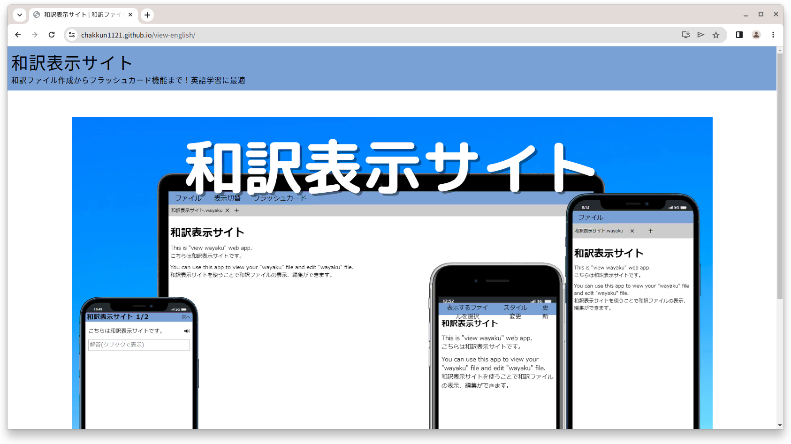
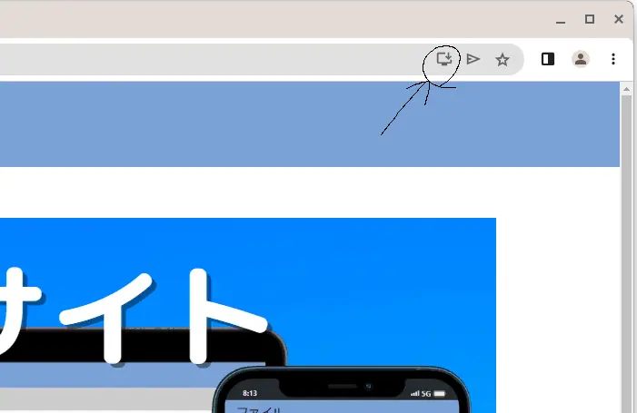

和訳表示サイトはパソコンやスマートフォンに保存されている和訳ファイル(.wayaku)を開いたり、編集したりするアプリです。和訳ファイルの作成もこのアプリでできます。
アプリと名乗っていますが、実際はブラウザ(google chrome を推奨)上で動いているウェブアプリケーションとなっております。しかし、このアプリはインストールしてご使用いただけます。

※注意:このアプリは chrome100 以上でしか利用ができません。それ以外のブラウザからは和訳表示サイト軽量版をご利用ください。

## 簡単な使い方

### 初期準備

このアプリをインストールするにはまず、[和訳表示サイトトップ](../)にアクセスします。

(画像は開発中のものです。実際とは異なる場合があります。)

その後、インストールボタンを押してインストールします。

インストール後に[アプリ本体](../../app)へ移動します。

### 和訳ファイルの作成

最初に和訳ファイルの作成が必要なので新しくファイルを作成するボタンを押します。

そこにタイトル、本文を入力します。

本文のところは英文、日本語訳の順に改行して入力します。(Excel などからのコピペも対応しています。)

完了したら完了ボタン(➁)を押します。作成をキャンセルしたいときにはキャンセルボタン(➀)を押します。

その後、自動的に和訳ファイルのダウンロードが行われます。万が一、そこでダウンロードをキャンセルした場合はファイル → 保存ボタンから手動でダウンロードしてください。

これで和訳ファイルの作成は完了です。

### 和訳ファイルを開く

和訳ファイルを開く際には新しいタブを開き、そこにある和訳ファイルを開くボタンから開くことができます。

また、アプリをインストールしていればエクスプローラーなどのファイルアプリから和訳ファイルの開く際のアプリとして登録できることもあります。その場合はいつものファイルを開く方法で和訳ファイルを開くことができます。
