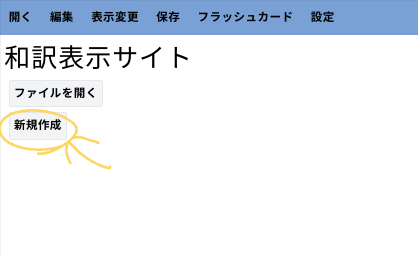

## 1. アプリ本体を開く

まず、[アプリ本体](../../app)へ移動します。

## 2. 新しくファイルを作成するボタンを押す

「新しくファイルを作成する」ボタンを押します。(編集ボタンを押しても同じです)



## 3. タイトル、本文を入力する

### タイトルの入力欄

上の大きな入力欄がタイトルの入力欄です。タイトルの文字数制限はありませんが、30 文字以内を推奨します。

### 本文入力欄

本文入力欄は 1 つのブロックに 2 つの入力欄があります。この入力欄は上に英文を、下に日本語訳を入力します。ブロックが足りなくなったら+ボタンを押してください。(上のと下の+ボタンは同じです。)


#### クリップボードからのコピー機能の使い方

このアプリではクリップボードからの入力ができます。英文、日本語訳が改行かタブ文字で区切られている場合はクリップボードからの入力ができます。

例:

```txt
This is "view wayaku" web app.
こちらは和訳表示サイトです。
You can use this app to view your "wayaku" file and edit "wayaku" file.
和訳表示サイトを使うことで和訳ファイルの表示、編集ができます。
```

また、以下のような表のコピペでも入力ができます。(ただし 1 列目は除いてください。また、タイトルの自動入力は今のところ対応していません。)

| 英文                                                                    | 日本語訳                                                       |
| ----------------------------------------------------------------------- | -------------------------------------------------------------- |
| This is “view wayaku” web app.                                          | こちらは和訳表示サイトです。                                   |
| You can use this app to view your “wayaku” file and edit “wayaku” file. | 和訳表示サイトを使うことで和訳ファイルの表示、編集ができます。 |

### 保存方法

入力が終わったら完了ボタンを押してから保存ボタンを押して保存します。(完了ボタンを押し忘れても一応保存できます。)
